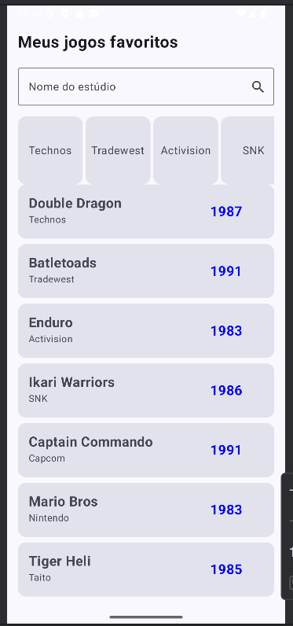
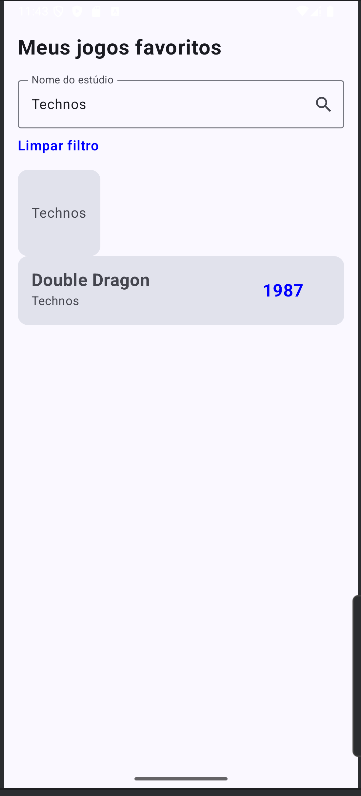
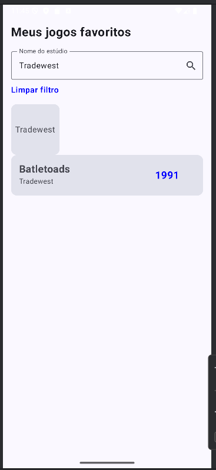

# Projeto: Lista de Jogos Favoritos com Jetpack Compose

Este projeto foi desenvolvido para a disciplina de Fundamentos do Jetpack Compose, criando um aplicativo Android que exibe uma lista de jogos e permite a filtragem dinâmica por estúdio.

---

## ✒️ Integrantes da Equipe

 - Vitoria Cerqueira, rm:552509
 - Felipe Pereira, rm: 551978
 - Leonardo Queiroz, rm:552500

---

## ✨ Funcionalidades

O aplicativo possui uma tela única com diversas funcionalidades interativas para gerenciar e visualizar a lista de jogos.

### 1. Tela Principal e Listagem de Jogos

Ao iniciar, o aplicativo exibe a lista completa de jogos favoritos em uma rolagem vertical. Cada item da lista mostra o nome do jogo, o estúdio e o ano de lançamento.

### 2. Filtro Rápido por Estúdio

Logo abaixo do campo de busca, há uma lista horizontal de estúdios. Ao tocar no card de um estúdio, a lista de jogos é imediatamente filtrada para exibir apenas os jogos daquele desenvolvedor.

### 3. Limpar Filtro

Sempre que um filtro está ativo (seja por texto ou por clique), um botão de texto "Limpar filtro" aparece na tela. Clicar nele remove todos os filtros aplicados e restaura a lista de jogos ao seu estado original.

---
### 📄 MainActivity.kt

É o **ponto de entrada** do aplicativo e o "dono" da nossa tela.

* **Analogia:** Pense na `MainActivity` como o **maestro de uma orquestra**. Ela não toca os instrumentos, mas é responsável por preparar o palco (a janela do app) e chamar o músico principal, que no nosso caso é a função `GamesScreen`. É a classe que conecta o mundo do sistema Android com o mundo da nossa interface gráfica feita em Jetpack Compose.
* **No nosso projeto:** A única responsabilidade dela é configurar o tema e chamar o Composable `GamesScreen`, onde toda a lógica da nossa tela acontece.

### 📁 components

Este pacote contém pequenos blocos de UI reutilizáveis.

* **Analogia:** Pense nos componentes como **peças de LEGO**. Criamos peças pequenas e especializadas, como um `GameCard` (para mostrar um jogo na lista) ou um `StudioCard` (para mostrar um estúdio na barra de filtro). Depois, na tela principal (`GamesScreen`), nós simplesmente montamos essas peças para construir a interface completa. Isso evita a repetição de código e mantém a tela principal mais limpa.
* **No nosso projeto:** Contém os arquivos `GameCard.kt` e `StudioCard.kt`.

### 📁 model

Este pacote define a **estrutura dos dados** com os quais nosso aplicativo trabalha.

* **Analogia:** É como o **molde de um bolo** ou um **formulário de cadastro**. Ele não é o bolo em si, nem o cadastro preenchido, mas define a *forma* que os dados devem ter. No nosso caso, ele define que um "Jogo" (`Game`) precisa ter um ID, um título, um nome de estúdio e um ano de lançamento.
* **No nosso projeto:** Contém a `data class` `Game.kt`, que é o nosso modelo de dados.

### 📁 repository

Este pacote funciona como a **fonte de dados** do aplicativo.

---
## 🛠️ Tecnologias Utilizadas

* **Linguagem:** Kotlin
* **UI Toolkit:** Jetpack Compose
* **Arquitetura:** State Management com `remember { mutableStateOf(...) }`
* **Componentes:** `LazyColumn`, `LazyRow`, `Card`, `OutlinedTextField`
* **Design:** Material 3